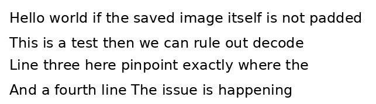
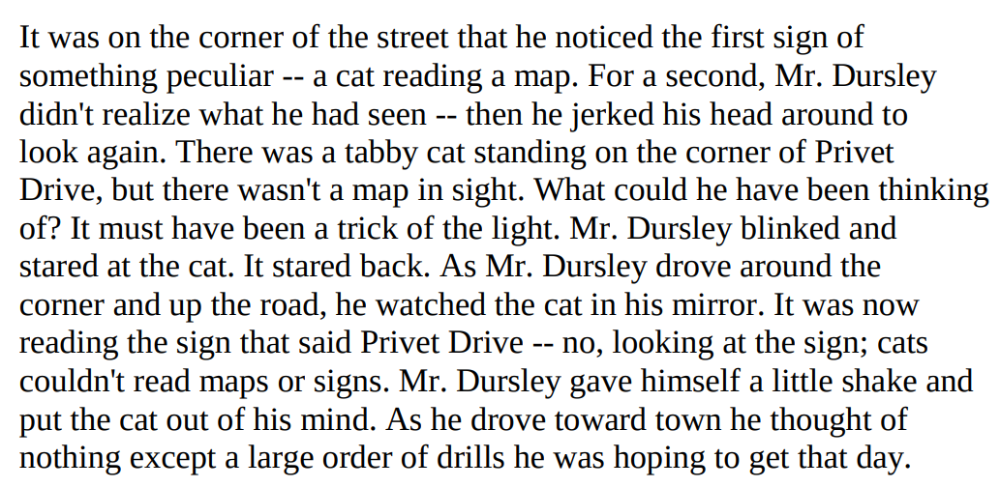
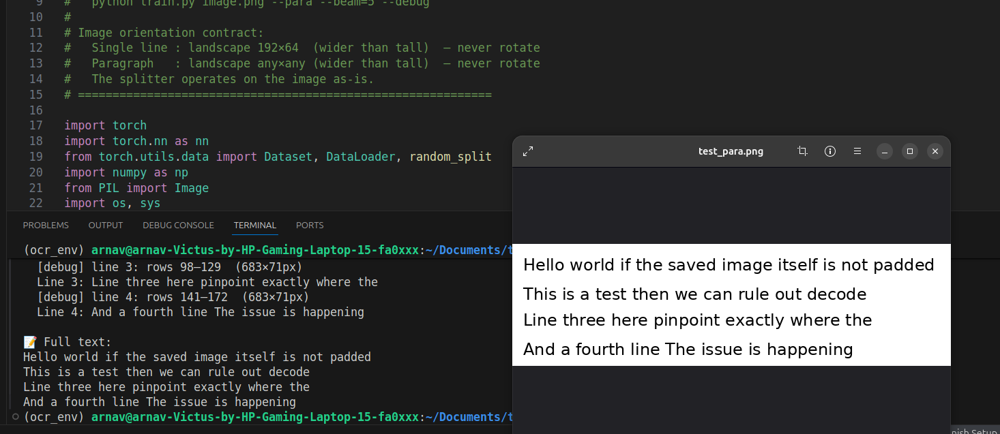

# Custom CNN OCR for CNN Accelerator

A lightweight, CTC-based OCR pipeline built on a custom convolutional neural network, designed to run on a custom CNN hardware accelerator. The model operates **line by line** — a horizontal projection splitter first segments a full paragraph image into individual text strips, and each strip is then fed through the CNN independently.

---

## Repository Structure

```
.
├── model1/                   # Model v1 — variable-width input (192 px lines)
│   ├── model.py
│   ├── train.py
│   ├── generate_dataset.py
│   ├── text_harry.png        # Sample test image (paragraph)
│   └── test_para.png         # Sample test image
│
└── model2/                   # Model v2 — fixed 480 px width (camera-aligned)
    ├── model.py
    ├── train.py
    └── generate_dataset.py
```

---

## How It Works

### Line-by-Line OCR Pipeline

The model does **not** process a full document image in one shot. Instead:

1. **Horizontal Projection Splitting** — the input image is binarised using Otsu thresholding and a row-wise ink projection profile is computed. Bands of rows with ink density above a threshold are detected as text lines. A small vertical dilation (3 px) bridges intra-character gaps (e.g., dots on *i* and *j*) without merging adjacent lines. Nearby bands are merged if the gap is less than 20% of the median band height.

2. **Per-Line Inference** — each detected strip is cropped, padded, resized to the model's fixed input dimensions `(64 × W)`, and passed through `LineCNN_OCR`.

3. **CTC Decoding** — the output sequence is decoded using greedy or beam search CTC decoding.

4. **Reassembly** — decoded strings from all lines are joined to produce the final paragraph text.

```
Full image
    │
    ▼
split_lines_projection()   ← horizontal projection profile
    │
    ├─ line strip 0 ──► LineCNN_OCR ──► CTC decode ──► "Hello world"
    ├─ line strip 1 ──► LineCNN_OCR ──► CTC decode ──► "The quick brown fox"
    └─ line strip N ──► LineCNN_OCR ──► CTC decode ──► "..."
                                                         │
                                                         ▼
                                                  Full paragraph text
```

### Character Set

Both models share the same 79-character vocabulary (plus CTC blank = index 0):

```
a-z  A-Z  0-9  space  . , ! ? ; : ' " - ( ) / @ # % &
```
`NUM_CLASSES = 80`

---

## Model v1

> Variable-width input — tested on scanned/rendered text images.

### Architecture — `LineCNN_OCR`

| Stage | Operation | Output shape `(H × W)` |
|---|---|---|
| Input | Grayscale line strip | `64 × 192` |
| Block 1 + Pool | `double_conv(1→32)` + `MaxPool(2,2)` | `32 × 96` |
| Block 2 + Pool | `double_conv(32→64)` + `MaxPool(2,1)` | `16 × 96` |
| Block 3 + Pool | `double_conv(64→128)` + `MaxPool(2,1)` | `8 × 96` |
| Block 4 + Pool | `double_conv(128→128)` + `MaxPool(2,1)` | `4 × 96` |
| Height collapse | `AdaptiveAvgPool2d((1, None))` | `1 × 96` |
| Classifier | `Conv1d(128→80, k=1)` + `log_softmax` | `(T=96, B, 80)` |

Each `double_conv` block is: `Conv2d → BN → ReLU → Conv2d → BN → ReLU`.

- **Parameters:** ~1.1 M
- **CTC time steps:** T = 96 (~20 characters per line at 4.8× ratio)
- **Input size:** `(B, 1, 64, 192)`

### Training

| Hyperparameter | Value |
|---|---|
| Batch size | 32 |
| Gradient accumulation steps | 4 (effective batch = 128) |
| Epochs | 100 |
| Optimiser | AdamW, lr = 5e-4, weight_decay = 2e-4 |
| Loss | CTC Loss |

### Usage

```bash
# Train
python model1/train.py

# Inference — single line image
python model1/train.py image.png

# Inference — paragraph (auto line split)
python model1/train.py image.png --para

# Beam search decoding
python model1/train.py image.png --para --beam=5

# Debug mode (saves per-line crops)
python model1/train.py image.png --para --beam=5 --debug
```

### Screenshots


**Paragraph input test (`test_para.png`):**



**Harry Potter text test (`text_harry.png`):**



**OCR Output:**


---

## Model v2

> Fixed 480 px input width — aligned to the final camera capture setup.

The physical OCR setup captures frames at **480 × 720 px** (width × height). Model v2 is designed to match this exactly — no aspect-ratio distortion, no padding surprises. Each detected line strip is resized to `64 × 480` before inference.

### Architecture — `LineCNN_OCR`

| Stage | Operation | Output shape `(H × W)` |
|---|---|---|
| Input | Grayscale line strip | `64 × 480` |
| Block 1 + Pool | `double_conv(1→32)` + `MaxPool(2,2)` | `32 × 240` |
| Block 2 + Pool | `double_conv(32→64)` + `MaxPool(2,1)` | `16 × 240` |
| Block 3 + Pool | `double_conv(64→128)` + `MaxPool(2,1)` | `8 × 240` |
| Block 4 + Pool | `double_conv(128→128)` + `MaxPool(2,1)` | `4 × 240` |
| Height collapse | `AdaptiveAvgPool2d((1, None))` | `1 × 240` |
| Classifier | `Conv1d(128→80, k=1)` + `log_softmax` | `(T=240, B, 80)` |

- **Parameters:** ~700 K
- **CTC time steps:** T = 240 (~80 characters per line at 3.0× ratio)
- **Input size:** `(B, 1, 64, 480)`

### Key Changes from Model v1

| Property | Model v1 | Model v2 |
|---|---|---|
| Input width | 192 px (variable) | **480 px (fixed)** |
| CTC time steps (T) | 96 | **240** |
| Max chars/line | ~20 | **~80** |
| Parameters | ~1.1 M | **~700 K** |
| Contrast enhancement | No | **Yes (`--enhance`)** |
| Checkpoint verification | No | **Yes (`verify_checkpoint`)** |
| Designed for | General images | **Camera (480 × 720)** |

The wider input (480 vs 192 px) means a longer CTC sequence (240 time steps) which comfortably handles up to ~80 characters per line — well suited to full-width camera captures. The parameter count is lower because the width reduction happens earlier and the sequence never collapses in the width dimension.

Model v2 also adds:
- **`enhance_contrast()`** — optional CLAHE-based pre-processing (`--enhance` flag) to handle uneven camera lighting.
- **`verify_checkpoint()`** — validates that a loaded `.pth` file actually produces `T=240` time steps, catching architecture/checkpoint mismatches at load time instead of silently producing wrong output.

### Training

| Hyperparameter | Value |
|---|---|
| Batch size | 32 |
| Gradient accumulation steps | 4 (effective batch = 128) |
| Epochs | 100 |
| Optimiser | AdamW, lr = 5e-4, weight_decay = 2e-4 |
| Loss | CTC Loss |

### Usage

```bash
# Train
python model2/train.py

# Inference — single line image (480×64)
python model2/train.py image.png

# Inference — paragraph (auto line split)
python model2/train.py image.png --para

# With beam search and contrast enhancement
python model2/train.py image.png --para --beam=5 --enhance

# Debug mode
python model2/train.py image.png --para --debug
```
PS: This model test accuracy is not optimal yet and must be improved before use.
---

## Hardware Target

Both models are designed for deployment on a **custom CNN accelerator**. Key design decisions made with the accelerator in mind:

- All convolutions use `3×3` kernels with `padding=1` — uniform kernel size simplifies hardware tiling.
- No skip connections / residual paths — purely sequential dataflow, friendly to pipeline stages.
- `AdaptiveAvgPool2d` collapses the height dimension to 1 before the classifier, reducing the final operation to a 1D `Conv1d` (pointwise projection).
- `BatchNorm` is used throughout — foldable into convolution weights at inference time, zero extra cost on hardware.
- Dropout (`p=0.2`) is training-only and drops out entirely at inference.

---

## Dependencies

```
torch
torchvision
opencv-python (cv2)
Pillow
numpy
```

---

## Dataset

Training data lives in `data_line/` (not committed). Each sample is a pair:

```
data_line/
├── 000001.png    ← grayscale line strip
├── 000001.txt    ← ground-truth text string
├── 000002.png
├── 000002.txt
└── ...
```

Dataset generation scripts (`generate_dataset.py`) render synthetic text lines using system fonts at randomised sizes, augmented with noise and distortion. For model v2, all generated lines are fixed at **480 px width**.

--- 

## Contributer

-Arnav Yadnopavit 
